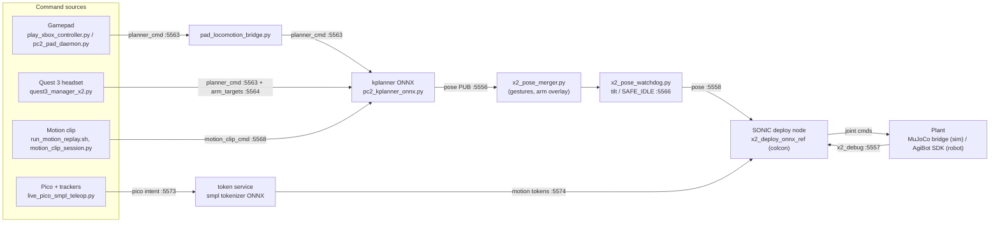
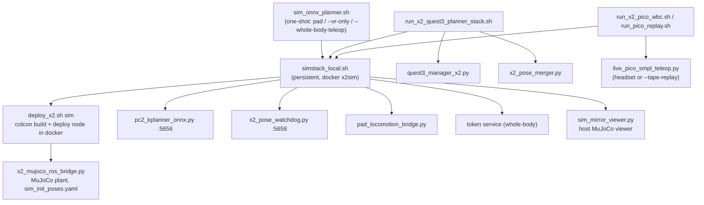
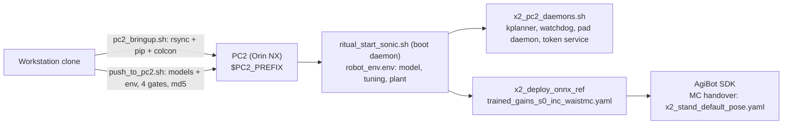
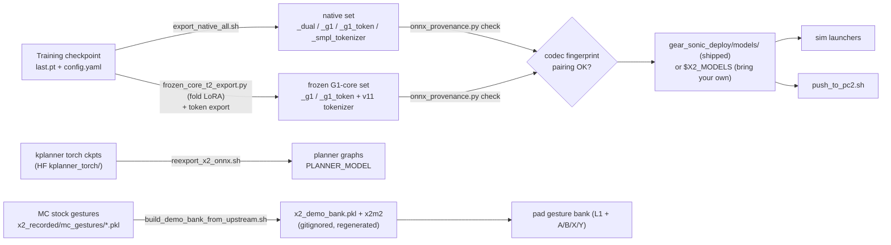
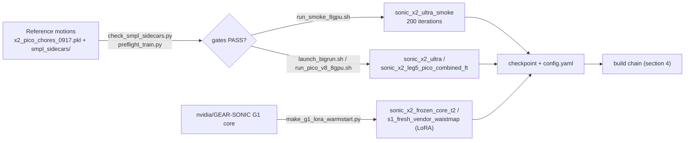
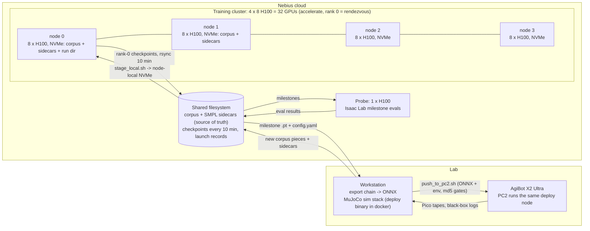

# X2 stack architecture

Diagrams of the runtime stacks, the teleop sources, the model build chain and
the training loop. Port numbers are the robot map from
[`x2_pc2/PORT_REGISTRY.md`](../../x2_pc2/PORT_REGISTRY.md); the sim map is the
same chain renamed +100 (5556 -> 5656, 5563 -> 5663, 5568 -> 5668).

## 1. Runtime pose chain (sim and robot share it)

Every controller ends in one place: a 50 Hz reference pose (or a motion
token) into the SONIC deploy node, which runs the ONNX policy and drives the
plant. In sim the plant is MuJoCo behind `x2_mujoco_ros_bridge.py`; on the
robot it is the AgiBot SDK behind the same colcon package.

The kplanner side is the pose encoder path of the policy; the Pico side is
the SMPL encoder path. `x2_pose_merger.py` arbitrates between them and the
gesture catalog (F08: one operator toggles locomotion and whole-body follow).

## 2. Sim launchers

## 3. Robot bring-up (PC2, colcon)

## 4. Model build chain

Which artifact rebuilds when a checkpoint or a script changes is tabulated in
[`BUILD_CHAIN.md`](BUILD_CHAIN.md).

## 5. Training loop (Isaac Lab, Nebius)

Three encoders train together on the same corpus: the G1 pose encoder, the
teleop encoder and the SMPL encoder (`sonic_x2_ultra.yaml`); every smoke and
training run therefore needs the SMPL sidecars next to the retargeted clips.

## 6. Training infrastructure (as used for the shipped sets)

Text version of the diagram

Training reads 100k+ small files from 32 processes, so `stage_local.sh` copies
the corpus to each node's NVMe before launch and only rank 0 writes
checkpoints, rsynced to the share every 10 minutes. The probe scores each
milestone without touching the training nodes; the workstation qualifies an
exported set in the deploy-faithful MuJoCo stack before `push_to_pc2.sh` puts
it on the robot. See [`F12_training_nebius.md`](F12_training_nebius.md) and
[`TRAINING_NOTES.md`](TRAINING_NOTES.md).
